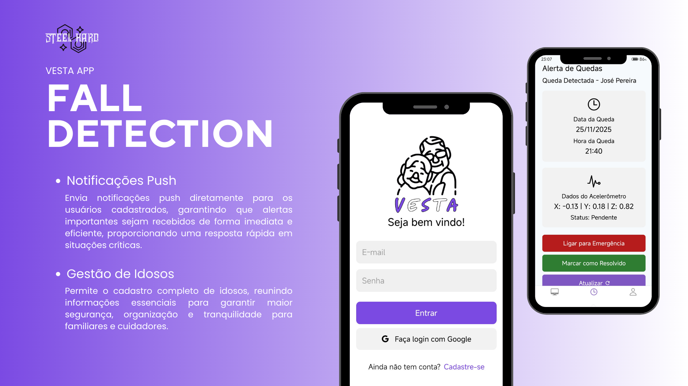
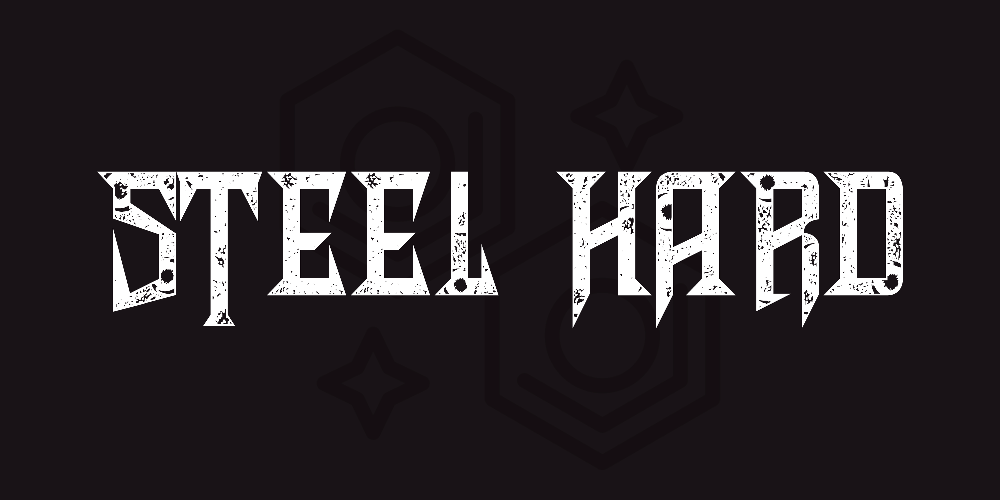

# 
# 

<div align="center">
<h1>
<a href="#descrição">Descrição</a> || 
<a href="#tecnologias">Tecnologias</a> || 
<a href="#dev-team">Dev Team</a> || 
<a href="#product-backlog">Product Backlog</a> || 
<a href="#scrum">Scrum</a> || 
<a href="#instalação">Instalação</a> || 
<a href="public/docs/ABP_VESTA.pdf">Diretrizes</a>
</h1>
</div>

## 📝 Descrição


<div style="text-align: justify;">
  <p style="text-align: justify;">
    O <strong>VESTA</strong> é um sistema inteligente de <strong>detecção de quedas para idosos</strong>, desenvolvido com o objetivo de promover segurança e bem-estar para pessoas em idade avançada que vivem sozinhas. O sistema identifica automaticamente ocorrências classificadas como queda e envia alertas imediatos para familiares ou cuidadores.
  </p>
  <p style="text-align: justify;">
    A solução é composta por um <strong>dispositivo vestível</strong>, conectado via Wi-Fi a um aplicativo mobile de monitoramento. Além disso, o VESTA emite <strong>alertas por SMS</strong> para um número previamente cadastrado, garantindo rápida resposta em situações de emergência.
  </p>
  <p style="text-align: justify;">
    O <strong>propósito principal</strong> do projeto é aumentar a independência de idosos, reduzir os riscos associados à demora no atendimento após quedas e fornecer tranquilidade para famílias e cuidadores.
  </p>
</div>

## 🛠️ Tecnologias Utilizadas


## 📋 User Stories

| ID    | User Story | Critérios de Aceitação |
|-------|------------|----------------------|
| US01  | Como idoso, quero me sentir seguro contra quedas, para que eu tenha proteção contínua. | a) Deve haver um acelerômetro e um microprocessador monitorando os movimentos do usuário.<br>b) Ao detectar uma queda, deve ser enviado um alerta imediatamente aos interessados.<br>c) Deve haver um botão de alerta manual, acionável pelo usuário.<br>d) Ao detectar bateria baixa ou falta de conexão, o aplicativo deve emitir alertas. |
| US02  | Como cuidador ou familiar, quero ser notificado quando meu ente querido sofrer uma queda, para poder agir rapidamente. | a) Ao detectar uma queda, deve ser enviado um alerta imediatamente aos interessados.<br>b) Ao detectar bateria baixa ou falta de conexão do dispositivo, o aplicativo deve emitir alertas. |
| US03  | Como usuário, quero reduzir falsos alertas, para que o sistema seja confiável e não cause frustração. | a) Devem existir mecanismos inteligentes para validar se ocorreu uma queda antes de disparar alertas. |
| US04  | Como usuário, quero que meus dados sejam seguros e privados, para garantir minha privacidade e conformidade legal. | a) Deve haver login com senha para o usuário e para os cuidadores.<br>b) O sistema deve estar em conformidade com a LGPD (Lei Geral de Proteção de Dados). |

## 📋 Product Backlog
| Número | Recurso Funcional           | Síntese do Requisito                                         | Status          |
|:------:|-----------------------------|:------------------------------------------------------------:|:---------------:|
|  RF01  | Detecção de Queda           | Identificar automaticamente quedas                           | 🟢 Concluído |
|  RF02  | Envio de Alertas push        | Disparar Push Notification para usuário previamente cadastrado              | 🟢 Concluído |
|  RF03  | Monitoramento Mobile        | Enviar dados em tempo real para o aplicativo mobile          | 🟢 Concluído |
|  RF04  | Histórico de Ocorrências    | Registrar e disponibilizar histórico de quedas               | 🟢 Concluído |
|  RF05  | Configuração de Usuários    | Cadastro e gerenciamento de perfis de usuários               | 🟢 Concluído |

| Número  | Recurso Não-Funcional       | Síntese do Requisito                                         | Status          |
|:-------:|-----------------------------|:------------------------------------------------------------:|:---------------:|
|  RNF01  | Baixa Latência              | Garantir resposta rápida na detecção de quedas               | 🟢 Concluído |
|  RNF02  | Interface Responsiva        | Aplicativo mobile com layout simples e acessível             | 🟢 Concluído |
|  RNF03  | Alta Disponibilidade        | Sistema sempre disponível e tolerante a falhas               | 🟢 Concluído |


## ⚙️ Instalação

```bash
# 1. Instalação das dependências do projeto
npm i

# 2. Rodar o frontend 
npm run start

# 3. Rodar o backend
npm run dev

# O servidor estará disponível localmente
```


### Configurações de PowerShell (se necessário)

```bash
Set-ExecutionPolicy -ExecutionPolicy Unrestricted -Scope CurrentUser
```

### Convenções de Commit


Para seguir boas práticas de commits no seu projeto, consulte o repositório:  
[Padrões de Commits](https://github.com/iuricode/padroes-de-commits).

## 🔄 Scrum
| Sprint                                    | Início     | Fim        | Status           | 📉 Burndown Chart                                        |
|:-----------------------------------------:|:----------:|:----------:|:----------------:|:---------------------------------------------------------:|
| 1 | 14/09/2025 | 08/10/2025 | 🟢 Concluído    | [Ver Gráfico](assets/burndown_sp1.png) |
| 2 | 09/10/2025 | 13/11/2025 | 🟢 Concluído  | [Ver Gráfico](assets/burndown_sp2.png) |
| 3 | 14/11/2025 | 25/11/2025 | 🟢 Concluído | [Ver Gráfico](assets/burndown_sp3.png) |

## 👨‍💻 Dev Team

| Nome                               | Função              | GitHub                                          |
|:----------------------------------:|:-------------------:|:-----------------------------------------------:|
| Nícolas Aquino                     | Product Owner       | [GitHub](https://github.com/Nickaqui)           |
| Vitor Francisco de Azevedo Zonzini | Scrum Master        | [GitHub](https://github.com/frevisto)           |
| Victor Hugo Dantas Carbajo         | Dev Team (Front-end)| [GitHub](https://github.com/Victor-Carbajo-DSM) |
| Lucas Roque Alvim Cruz             | Dev Team (Front-end)| [GitHub](https://github.com/lucasroqe)          |
| Maurício Oliveira Medeiros Cepinho | Dev Team (Back-end) | [GitHub](https://github.com/maucepinho)         |
| Cláudio dos Santos Siqueira Júnior | Dev Team (Back-end) | [GitHub](https://github.com/claudsaints)        |
| Ricardo Ladeira                    | Dev Team (Back-end) | [GitHub](https://github.com/rladeiraFatec)      |
